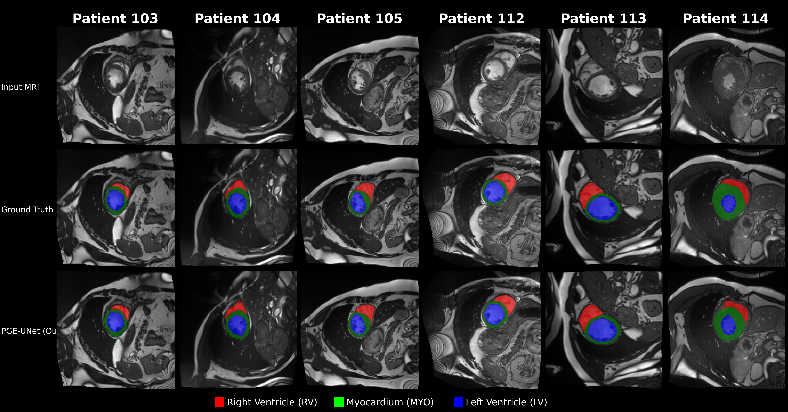

# Intergrating Physics Guidance Into Deep Learning for Cine Cardiovascular Segmentation

---

## 📋 Table of Contents

- [Overview](#overview)
- [Installation](#installation)
- [Dataset Preparation](#dataset-preparation)
- [Usage](#usage)
  - [Preprocessing](#preprocessing)
  - [Training](#training)
  - [Evaluation](#evaluation)
- [Results](#results)
- [Ablation Study](#ablation-study)
- [Citation](#citation)
- [License](#license)

---

## Overview

Cine cardiovascular magnetic resonance (CMR) provides dynamic sequences for quantifying clinically important indices such as ventricular volumes and ejection fraction. Fast and accurate deep segmentation model is therefore valuable for timely analysis, reducing manual workload and improving reproducibility in routine workflows. However, most existing segmentation models remain largely data-driven and lack explicit physical constraints, which can reduce prediction plausibility under realistic acquisition variability.

In this work, we present **PGE-UNet**, an efficient segmentation framework for cine CMR that incorporates radiofrequency-related information to promote physically plausible outputs. Specifically, it employs the proposed **Noise-Aware Encoder** with self-supervised noise estimation and smoothing mechanism for robust feature encoding, and the **Physics-Regularized Decoder** that enforce Maxwell-Helmholtz consistency under a pseudo transmit-field prior $\hat{B}^+_1$. Since transmit-field measurements are typically unavailable in standard protocols, we further introduce a simulator-based procedure to synthesize $\hat{B}^+_1$, enabling physics-regularized training without additional mapping sequences.

Experiments on three public cine CMR benchmarks demonstrate strong accuracy in both DICE and HD95, achieving foreground average DICE of **0.9152** on ACDC, **0.8605** on M&Ms, and **0.9291** on SCD, while remaining lightweight with only **1.60 million parameters** in the default setting. Under CPU-only inference, the default configuration recorded an average latency of **72.38 ms** per case, making it suitable for deployment in time-sensitive and resource-constrained environments.

### Key Features

| Feature | Description |
|---------|-------------|
| **2.5D Input** | 2.5D input for param-efficient |
| **Noise-Aware Encoder** | Physics-inspired noise estimation |
| **Physics-Regularized Decoder** | Electromagnetic field constraints via Maxwell equations |
| **Multiple Variants Support** | Support for various model configurations |

---

## Installation

### Requirements

- Python 3.11
- PyTorch 2.6
- CUDA 12.4

### Setup Environment

```bash
# 1. Clone the repository
git clone https://github.com/yourusername/PGE-UNet.git
cd PGE-UNet

# 2. Create conda environment
conda create -n pge-unet python=3.11 -y
conda activate pge-unet

# 3. Install PyTorch with CUDA 12.4
pip install torch==2.6.0 torchvision==0.21.0 --index-url https://download.pytorch.org/whl/cu124

# 4. Install dependencies
pip install -r requirements.txt
```

---

## Dataset Preparation

### Supported Datasets

| Dataset | Task | Classes | Download Link |
|---------|------|---------|---------------|
| **ACDC** | Cardiac Segmentation | 4 (BG, RV, MYO, LV) | [ACDC Challenge](https://www.creatis.insa-lyon.fr/Challenge/acdc/) |
| **M&M** | Multi-Centre Cardiac | 4 (BG, RV, MYO, LV) | [M&M Challenge](https://www.ub.edu/mnms/) |
| **SCD** | Sunnybrook Cardiac | 2 (BG, LV) | [Sunnybrook Dataset](http://www.cardiacatlas.org/studies/sunnybrook-cardiac-data/) |

### Directory Structure

Datasets must be downloaded, unzipped, and organized in `/data`. The standard structure:

```
Phys/
├── data/
│   ├── ACDC/
│   ├── MnM/
│   └── SCD/
│
├── preprocessed_data/
└── weights/
```

---

## Usage

### Preprocessing

Raw datasets must be preprocessed before training to convert to `.npy` format and generate pseudo B1 maps using simulator. Preprocessed data is saved to `/preprocessed_data`.

```bash
conda activate pge-unet
cd /path/to/Phys

# Preprocess ACDC dataset
python scripts/preprocess_acdc.py

# Preprocess M&M dataset
python scripts/preprocess_mnm.py

# Preprocess SCD dataset
python scripts/preprocess_scd.py
```

### Training

#### Main PGE-UNet Model

```bash
conda activate pge-unet
cd /path/to/Phys

# Train on ACDC (default: 250 epochs with early stopping)
python scripts/train_acdc.py

# Train on M&M
python scripts/train_mnm.py

# Train on SCD
python scripts/train_scd.py
```

**Output Weights** (saved to `weights/`):

Pretrained weights will be published after paper acceptance. Currently, weights are provided as requested from reviewers and editors via email.

### Evaluation

```bash
conda activate pge-unet
cd /path/to/Phys

# Evaluate main model on ACDC test set
python scripts/evaluate_acdc.py

# Evaluate on M&M test set
python scripts/evaluate_mnm.py

# Evaluate on SCD test set
python scripts/evaluate_scd.py
```

---

## Results

<p align="center">
  
</p>

<p align="center">
  <em>Segmentation results on ACDC test patients. Rows: Input MRI, Ground Truth, PGE-UNet. Columns: Different patients (103-114).<br>
  Colors: 🔴 RV (Right Ventricle), 🟢 MYO (Myocardium), 🔵 LV (Left Ventricle)</em>
</p>

### Qualitative Comparison

<p align="center">
  
</p>

---

## Multi-variant Support

### Model Profile Comparison

| Profile | Input Slices | Depth | Params | GFLOPs | Mean Dice |
|---------|-------------|-------|--------|--------|-----------|
| **S** (Small) | 3 | 4 | 0.5M | 12.3 | 0.8921 |
| **M** (Medium) | 5 | 5 | 1.6M | 28.7 | 0.9152 |
| **L** (Large) | 7 | 6 | 4.2M | 56.4 | 0.9198 |

### Training Profiles

```bash
conda activate pge-unet
cd /path/to/Phys

# Train specific profile
python -m profiles.train_profile --profile S    # Small
python -m profiles.train_profile --profile M    # Medium
python -m profiles.train_profile --profile L    # Large


# Train all profiles sequentially
python -m profiles.run_full_ablation

# Evaluate specific profile
python -m profiles.evaluate_3d --profile T

# Measure computational metrics
python -m profiles.measure_profile
```

---

## Citation

Citation link will be updated later.

---

## License

This project is for **research purposes only**. 

For commercial use, please contact the authors.

---

## Acknowledgements

This project builds upon the knowledge and codebases of:

- **UNet++**: A Nested U-Net Architecture for Medical Image Segmentation.
- **Nested U-Net**: Deep supervision and dense skip pathways.
- **nnUNet**: Self-adapting Framework for U-Net-Based Medical Image Segmentation.
- **Swin-Unet**: Unet-like Pure Transformer for Medical Image Segmentation.

