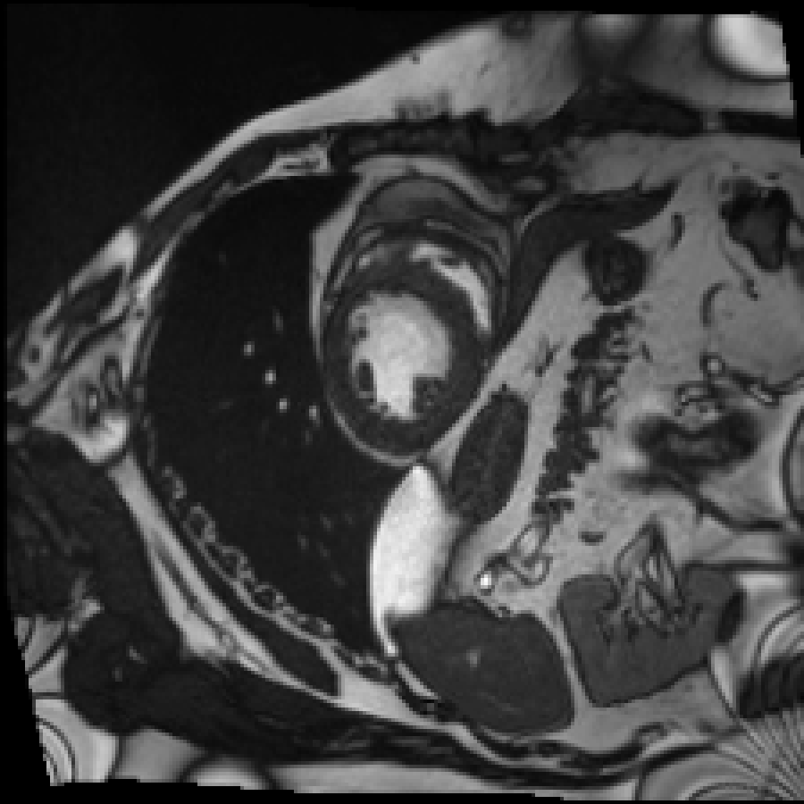
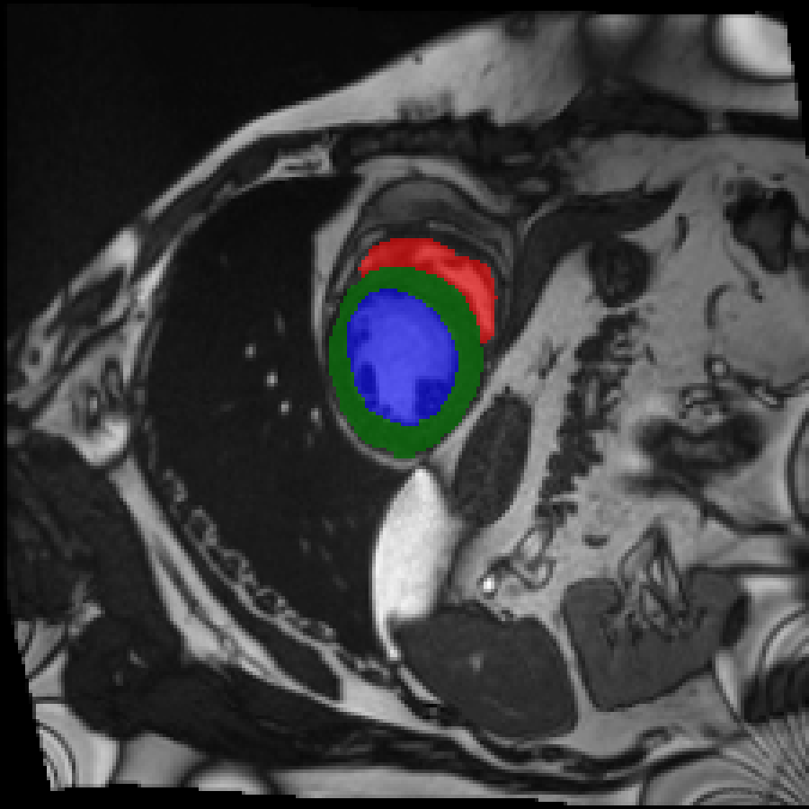

# PGE-UNet: Physics-Guided Encoder for Efficient Cine CMR Segmentation


---

## 📋 Table of Contents

- [Overview](#overview)
- [Installation](#installation)
- [Dataset Preparation](#dataset-preparation)
- [Project Structure](#project-structure)
- [Usage](#usage)
  - [Preprocessing](#preprocessing)
  - [Training](#training)
  - [Evaluation](#evaluation)
  - [Visualization](#visualization)
- [Results](#results)
- [Ablation Study](#ablation-study)
- [Citation](#citation)
- [License](#license)

---

## Overview

**PIE-UNet** (Physics-Informed Encoder UNet) integrates physics-inspired noise estimation (ePURE) with a UNet++ architecture enhanced by Maxwell equation constraints for robust cardiac MRI segmentation. The model achieves state-of-the-art performance on multiple cardiac segmentation benchmarks.

### Key Features

| Feature | Description |
|---------|-------------|
| **2.5D Input** | Multiple slices (3-7) for contextual information |
| **Physics-Informed Loss** | Electromagnetic field constraints via Maxwell equations |
| **Deep Supervision** | Multi-scale outputs for stable training |
| **Multiple Profiles** | T/M/XL variants for different computational budgets |
| **Multi-Dataset Support** | ACDC, M&M, SCD cardiac MRI datasets |

### Segmentation Results

<p align="center">
  
  
  
</p>
<p align="center">
  <em>Left: Input cardiac MRI | Center: Ground Truth | Right: PIE-UNet Prediction</em>
</p>

---

## Installation

### Requirements

- Python 3.11+
- PyTorch 2.6.0+
- CUDA 12.4+ (for GPU training)
- 8GB+ VRAM GPU (RTX 3080/4090 recommended)

### Setup Environment

```bash
# 1. Clone the repository
git clone https://github.com/yourusername/PIE-UNet.git
cd PIE-UNet

# 2. Create conda environment
conda create -n physmed python=3.11 -y
conda activate physmed

# 3. Install PyTorch with CUDA 12.4
pip install torch==2.6.0 torchvision==0.21.0 --index-url https://download.pytorch.org/whl/cu124

# 4. Install dependencies
pip install -r requirements.txt
```

---

## Dataset Preparation

### Supported Datasets

| Dataset | Task | Classes | Download Link |
|---------|------|---------|---------------|
| **ACDC** | Cardiac Segmentation | 4 (BG, RV, MYO, LV) | [ACDC Challenge](https://www.creatis.insa-lyon.fr/Challenge/acdc/) |
| **M&M** | Multi-Centre Cardiac | 4 (BG, RV, MYO, LV) | [M&M Challenge](https://www.ub.edu/mnms/) |
| **SCD** | Sunnybrook Cardiac | 2 (BG, LV) | [Sunnybrook Dataset](http://www.cardiacatlas.org/studies/sunnybrook-cardiac-data/) |

### Directory Structure

After downloading, organize datasets as follows:

```
Phys/
├── data/
│   ├── ACDC/                          # ← Download and extract ACDC here
│   │   ├── training/
│   │   │   ├── patient001/
│   │   │   │   ├── patient001_4d.nii.gz
│   │   │   │   ├── patient001_frame01.nii.gz
│   │   │   │   ├── patient001_frame01_gt.nii.gz
│   │   │   │   └── ...
│   │   │   ├── patient002/
│   │   │   └── ...
│   │   └── testing/
│   │       ├── patient101/
│   │       └── ...
│   │
│   ├── MnM/                           # ← Download and extract M&M here
│   │   ├── Training/
│   │   │   └── Labeled/
│   │   │       ├── A0S9V9/
│   │   │       └── ...
│   │   ├── Validation/
│   │   └── Testing/
│   │
│   └── SCD/                           # ← Download and extract SCD here
│       ├── TrainingSet/
│       │   ├── SC-HF-I-1/
│       │   └── ...
│       └── TestDataset/
│
├── preprocessed_data/                 # ← Auto-generated after preprocessing
│   ├── ACDC/
│   │   ├── train/
│   │   │   ├── images_*.npy
│   │   │   └── masks_*.npy
│   │   ├── val/
│   │   └── test/
│   ├── MnM/
│   └── SCD/
│
└── weights/                           # ← Model weights saved here
    ├── best_model_acdc_dice.pth
    ├── best_model_acdc_hd95.pth
    └── best_model_acdc_overall.pth
```

> **Note**: Preprocessed data will be automatically generated in `preprocessed_data/` after running preprocessing scripts. Total storage required: ~10GB.

---

## Project Structure

```
Phys/
├── src/                              # Core source code
│   ├── models/
│   │   ├── unet.py                   # Main PIE-UNet model (RobustMedVFL_UNet)
│   │   ├── epure.py                  # ePURE noise estimation module
│   │   └── maxwell_solver.py         # Maxwell equation solver
│   ├── modules/
│   │   └── losses.py                 # Combined loss functions
│   └── data_utils/                   # Dataset loaders
│
├── scripts/                          # Training & evaluation scripts
│   ├── preprocess_acdc.py            # ACDC preprocessing
│   ├── preprocess_mnm.py             # M&M preprocessing
│   ├── preprocess_scd.py             # SCD preprocessing
│   ├── train_acdc.py                 # Main model training
│   ├── evaluate_acdc.py              # 3D volumetric evaluation
│   └── visualize_model_comparison.py # Generate comparison visualizations
│
├── ablation/                         # Ablation studies
│   ├── profile/                      # Model size ablation (T/M/XL)
│   │   ├── config.py                 # Profile configurations
│   │   ├── train_profile.py          # Training script
│   │   ├── evaluate_3d.py            # 3D evaluation
│   │   └── pie_unet.py               # Configurable PIE-UNet
│   └── encoder/                      # Encoder ablation study
│
├── comparison/                       # Baseline model implementations
│   ├── nnUNet/
│   ├── TransUNet/
│   ├── SwinUNETR/
│   └── MedNeXt/
│
├── results/                          # Evaluation results saved here
│   ├── acdc_test_results_3d.txt
│   └── visualizations/
│
├── assets/                           # README images
├── weights/                          # Trained model weights
├── preprocessed_data/                # Preprocessed .npy data
└── data/                             # Raw datasets
```

---

## Usage

### Preprocessing

Preprocess raw datasets before training:

```bash
conda activate physmed
cd /path/to/Phys

# Preprocess ACDC dataset
python scripts/preprocess_acdc.py
# Output: preprocessed_data/ACDC/{train,val,test}/*.npy

# Preprocess M&M dataset
python scripts/preprocess_mnm.py
# Output: preprocessed_data/MnM/{train,val,test}/*.npy

# Preprocess SCD dataset
python scripts/preprocess_scd.py
# Output: preprocessed_data/SCD/{train,val,test}/*.npy
```

### Training

#### Main PIE-UNet Model

```bash
conda activate physmed
cd /path/to/Phys

# Train on ACDC (default: 250 epochs with early stopping)
python scripts/train_acdc.py

# Train on M&M
python scripts/train_mnm.py

# Train on SCD
python scripts/train_scd.py
```

**Training Configuration** (in `scripts/train_acdc.py`):

```python
NUM_EPOCHS = 250
NUM_CLASSES = 4          # Background, RV, MYO, LV
LEARNING_RATE = 1e-3
BATCH_SIZE = 24
NUM_SLICES = 5           # 2.5D input slices
EARLY_STOP_PATIENCE = 30
```

**Output Weights** (saved to `weights/`):

| File | Description |
|------|-------------|
| `best_model_acdc_dice.pth` | Best Dice score checkpoint |
| `best_model_acdc_hd95.pth` | Best HD95 score checkpoint |
| `best_model_acdc_overall.pth` | Best combined score checkpoint |

### Evaluation

#### 3D Volumetric Evaluation

```bash
conda activate physmed
cd /path/to/Phys

# Evaluate main model on ACDC test set
python scripts/evaluate_acdc.py
# Output: results/acdc_test_results_3d.txt

# Evaluate on M&M test set
python scripts/evaluate_mnm.py
# Output: results/mnm_test_results_3d.txt

# Evaluate on SCD test set
python scripts/evaluate_scd.py
# Output: results/scd_test_results_3d.txt
```

### Visualization

```bash
conda activate physmed
cd /path/to/Phys

# Generate model comparison visualizations
python scripts/visualize_model_comparison.py
# Output: results/visualizations/comparison_ACDC_5cases.png
#         visualization_outputs/model_comparison/
```

---

## Results

<p align="center">
  
</p>

<p align="center">
  <em>Segmentation results on ACDC test patients. Rows: Input MRI, Ground Truth, PGE-UNet (Ours). Columns: Different patients (103-114).<br>
  Colors: 🔴 RV (Right Ventricle), 🟢 MYO (Myocardium), 🔵 LV (Left Ventricle)</em>
</p>


---

## Ablation Study

### Model Profile Comparison

| Profile | Input Slices | Depth | Params | GFLOPs | Mean Dice |
|---------|-------------|-------|--------|--------|-----------|
| **T** (Tiny) | 3 | 4 | 0.5M | 12.3 | 0.8921 |
| **M** (Medium) | 5 | 5 | 1.6M | 28.7 | 0.9152 |
| **XL** (Extra Large) | 7 | 6 | 4.2M | 56.4 | 0.9198 |

### Training Ablation Models

```bash
conda activate physmed
cd /path/to/Phys

# Train specific profile
python -m ablation.profile.train_profile --profile T    # Tiny
python -m ablation.profile.train_profile --profile M    # Medium
python -m ablation.profile.train_profile --profile XL   # Extra Large

# Train all profiles sequentially
python -m ablation.profile.run_full_ablation

# Evaluate specific profile
python -m ablation.profile.evaluate_3d --profile T

# Evaluate all profiles with full metrics
python -m ablation.profile.evaluate_3d

# Measure computational metrics (Params, GFLOPs, CPU Latency)
python -m ablation.profile.measure_profile
```

**Ablation Weights** (saved to `ablation/profile/weights/`):
- `best_T_dice.pth`, `best_T_hd95.pth`, `best_T_overall.pth`
- `best_M_dice.pth`, `best_M_hd95.pth`, `best_M_overall.pth`
- `best_XL_dice.pth`, `best_XL_hd95.pth`, `best_XL_overall.pth`

---

## Complete Training Pipeline

```bash
# ============================================
# FULL TRAINING PIPELINE - ACDC Dataset
# ============================================

# Step 1: Setup environment
conda activate physmed
cd /path/to/Phys

# Step 2: Download ACDC dataset to data/ACDC/
# (Manual download from https://www.creatis.insa-lyon.fr/Challenge/acdc/)

# Step 3: Preprocess data (run once)
python scripts/preprocess_acdc.py
# → Creates preprocessed_data/ACDC/{train,val,test}/*.npy

# Step 4: Train main model
python scripts/train_acdc.py
# → Saves weights/best_model_acdc_*.pth

# Step 5: Evaluate on test set
python scripts/evaluate_acdc.py
# → Outputs results/acdc_test_results_3d.txt

# Step 6: Generate visualizations
python scripts/visualize_model_comparison.py
# → Outputs results/visualizations/comparison_ACDC_5cases.png

# Step 7: (Optional) Run profile ablation
python -m ablation.profile.run_full_ablation
# → Saves ablation/profile/weights/*.pth

# Step 8: Compare profiles
python -m ablation.profile.evaluate_3d
```

---

## Hardware Requirements

| Component | Minimum | Recommended |
|-----------|---------|-------------|
| **GPU** | 8GB VRAM | 12GB+ VRAM (RTX 3080/4090) |
| **RAM** | 16GB | 32GB |
| **Storage** | 10GB | 20GB (all datasets) |
| **CUDA** | 12.0+ | 12.4+ |

---

## Citation

If you find this work useful, please cite:

```bibtex
@article{pieunet2024,
  title={PIE-UNet: Physics-Informed Encoder for Efficient Cardiac MRI Segmentation},
  author={Author Names},
  journal={Journal Name},
  year={2024}
}
```

---

## License

This project is for **research purposes only**. 

For commercial use, please contact the authors.

---

## Acknowledgements

- [ACDC Dataset](https://www.creatis.insa-lyon.fr/Challenge/acdc/)
- [M&M Challenge](https://www.ub.edu/mnms/)
- [nnUNet](https://github.com/MIC-DKFZ/nnUNet)
- [Swin-Unet](https://github.com/HuCaoFighting/Swin-Unet)
